# Distributables

This repository contains release binaries for most of our projects. You can download and install them on your system.

> [!IMPORTANT]
> All of our software is clean and virus-free. You may scan any release with VirusTotal or other antivirus software before installation.
> 
> **For macOS Users:**  
> Our apps are not signed or notarized, so macOS may display a warning stating that the app is "damaged and can’t be opened." To bypass this:
> 
> Right-click the app, select "Open", then click "Open" again.
> 
> Alternatively, you can remove macOS’s security flag via Terminal:
> ```
> sudo xattr -rd com.apple.quarantine /Applications/YourApp.app
> ```
> Most users will find the first method sufficient.
>
> ***⚠️ Do not download our apps from untrusted sources. Always use official links.***

> [!NOTE]
> We plan to implement code-signing in future releases for improved security and trust.

## Quick Links to Apps

*   [Synthdat](#synthdat)
*   [Dungen](#dungen)
*   [Dungen AI](#dungen-ai)
*   [Dungen for Android](#dungen-for-android)

---

## Available Apps

### Synthdat
<a name="synthdat"></a>
Synthdat is a dataset generation app, that generates new datasets from existing datasets using fine-grained AI models. Our team trained and tested these models to ensure that the generated synthetic data matched the characteristics of the original data.

#### Changelog

##### Version 1.1.0 (New)
*   New model dataset generator.
*   Totally new and improved UI.
*   Stability improvements.
*   **Screenshots:**
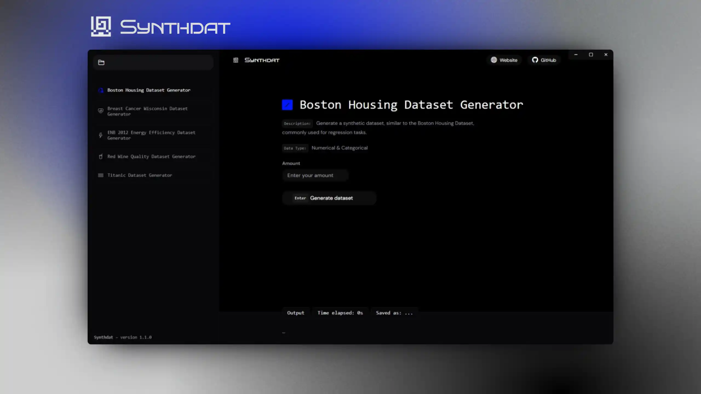
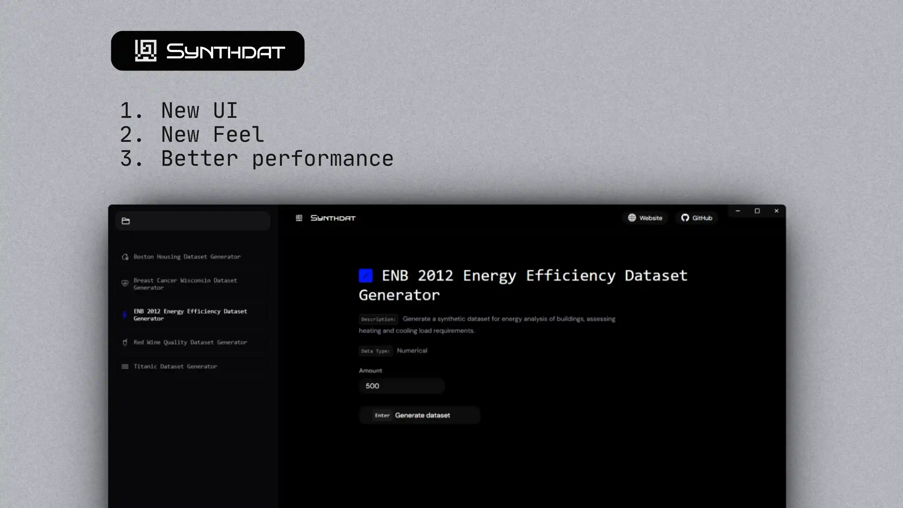
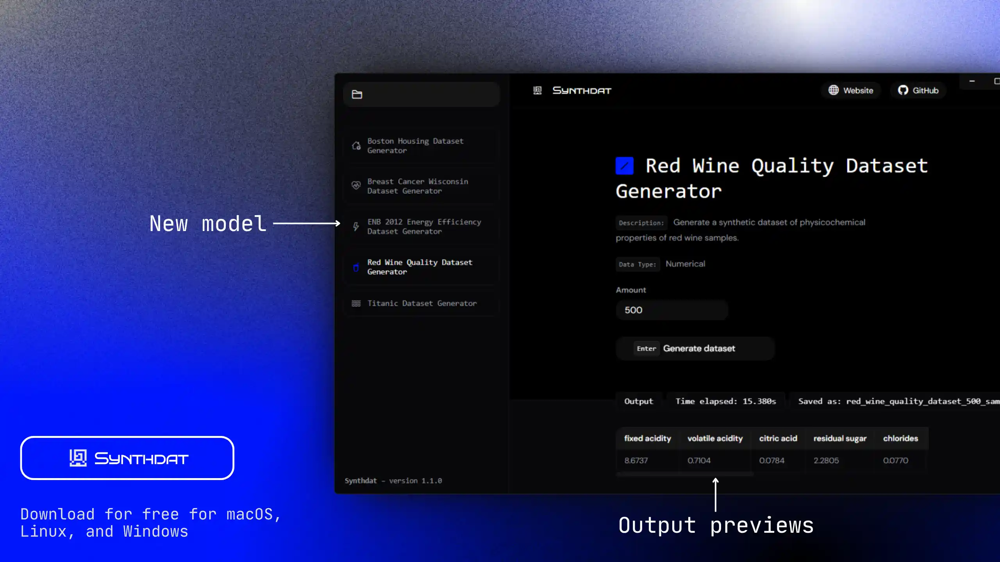

##### Version 1.0.0
*   Added more AI generators to Synthdat.
*   Created a simple user interface to handle processes.
*   Implemented asynchronous generation.
*   **Screenshots:**
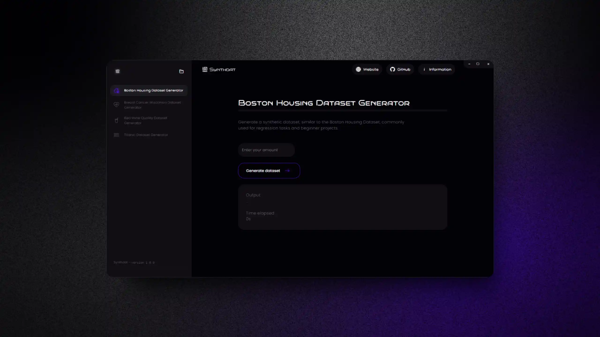
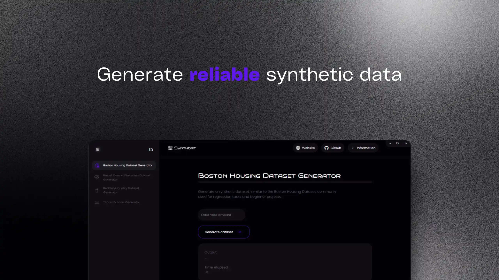
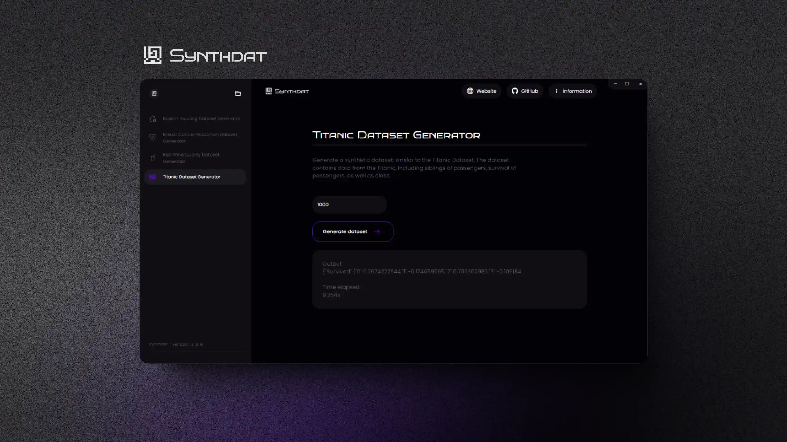

#### Minimum Requirements

**Storage:**
- **Minimum:** 0.5 GB of available disk space
- **Recommended:** 1 GB of available disk space

**RAM:**
- **Minimum:** 2 GB
- **Recommended:** 4 GB

**Processor:**
- **Minimum:** Dual-core 1.5 GHz
- **Recommended:** Quad-core 2.0 GHz or higher

**GPU:**
- **Minimum:** Integrated graphics with OpenGL 2.0 support
- **Recommended:** Dedicated GPU with at least 1 GB VRAM

#### Operating System Specifics
**macOS:**
- **Minimum:** macOS 10.13 (High Sierra)
- **Recommended:** macOS 11.0 (Big Sur) or later

**Linux:**
- **Minimum:** Ubuntu 18.04 LTS or equivalent
- **Recommended:** Ubuntu 20.04 LTS or equivalent

**Windows:**
- **Minimum:** Windows 10 (64-bit)
- **Recommended:** Windows 11 (64-bit)

> [!WARNING]
> Synthdat does not officially support lower platform versions than the versions specified. We don't recommend running Synthdat on these systems.

#### Platforms
| Platform | Available For Platform | Direct App | Setup
|----------------------|---|---|---|
| macOS | :ballot_box_with_check: | :ballot_box_with_check: | :x: |
| Windows | :ballot_box_with_check: | :ballot_box_with_check: | :x: |
| Linux | :ballot_box_with_check: | :ballot_box_with_check: | :x: |
| Android | :x: | :x: | :x: |
| iOS | :x: | :x: | :x: |

---

### Dungen
<a name="dungen"></a>
Dungen is a name generator, designed to generate names based on a few select games, from Terraria to Elden Ring. It also has a few customization options to tune the name generator to create different names.

#### Changelog
##### Version 1.3.0
*   6 new name generators.
*   Legibility improvements in UI.

##### Version 1.2.0
*   Can now generate up to 10000 names in a single click.
*   9 new name generators.
*   **Screenshots:**
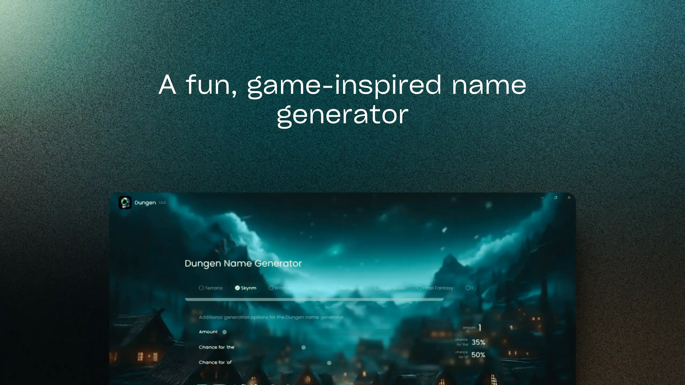
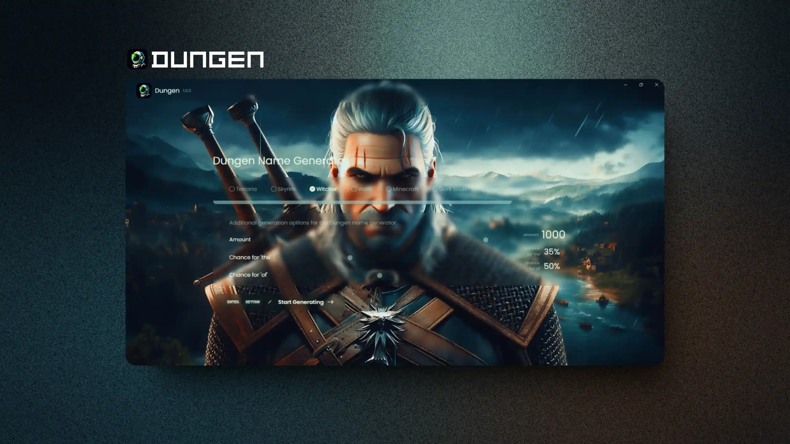
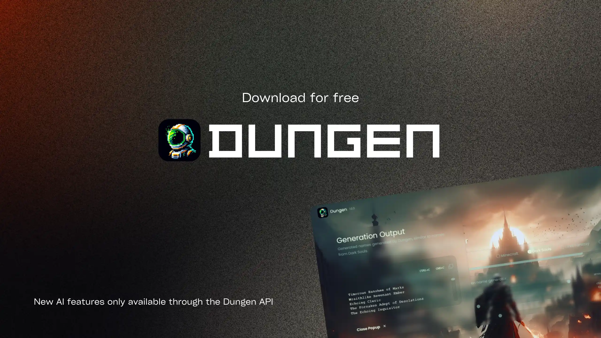

##### Version 1.1.0
*   Brand new names to generate, with 5+ new games available.
*   Improved name generation logic by adding certain checks.

##### Version 1.0.0
*   Optimized images.
*   Disabled `devTools`, as it is no longer needed.
*   Added the ability to generate up to 1000 names in one go.

#### Minimum Requirements

**Storage:**
- **Minimum:** 0.5 GB of available disk space
- **Recommended:** 1 GB of available disk space

**RAM:**
- **Minimum:** 2 GB
- **Recommended:** 4 GB

**Processor:**
- **Minimum:** Dual-core 1.5 GHz
- **Recommended:** Quad-core 2.0 GHz or higher

**GPU:**
- **Minimum:** Integrated graphics with OpenGL 2.0 support
- **Recommended:** Dedicated GPU with at least 0.5 GB VRAM

#### Operating System Specifics
**macOS:**
- **Minimum:** macOS 10.13 (High Sierra)
- **Recommended:** macOS 11.0 (Big Sur) or later

**Linux:**
- **Minimum:** Ubuntu 18.04 LTS or equivalent
- **Recommended:** Ubuntu 20.04 LTS or equivalent

**Windows:**
- **Minimum:** Windows 10 (64-bit)
- **Recommended:** Windows 11 (64-bit)

> [!WARNING]
> Dungen does not officially support lower platform versions than the versions specified. We don't recommend running Dungen on these systems.

#### Platforms
| Platform | Available For Platform | Direct App | Setup
|----------------------|---|---|---|
| macOS | :ballot_box_with_check: | :x: | :ballot_box_with_check: |
| Windows | :ballot_box_with_check: | :x: | :ballot_box_with_check: |
| Linux | :ballot_box_with_check: | :ballot_box_with_check: | :x: |
| Android | :x: | :x: | :x: |
| iOS | :x: | :x: | :x: |

---

### Dungen AI
<a name="dungen-ai"></a>
Dungen AI is a game name generator using AI models to generate names based on games. You can run the AI models locally and when offline.

#### Changelog

##### Version 1.2.0 Public Beta
*   9 new AI models to use
*   Improved UI
*   Minor performance improvements
*   **Screenshots:**
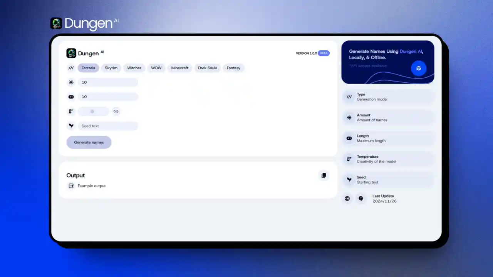
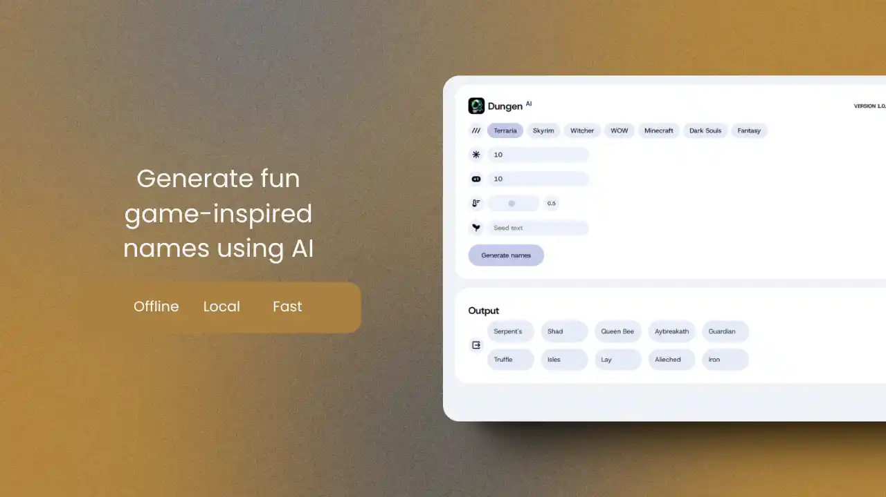


##### Version 1.1.0 Public Beta
*   11 new AI models to choose from
*   Improved compatibility and performance due to removal of outdated package dependencies

##### Version 1.0.0 Public Beta
*   All current AI models from `Dungen's Huggingface space` were added to the app.
*   Initial release of `Dungen AI 1.0.0`.

#### Minimum Requirements

**Storage:**
- **Minimum:** 1 GB of available disk space
- **Recommended:** 2 GB of available disk space

**RAM:**
- **Minimum:** 2 GB
- **Recommended:** 4 GB

**Processor:**
- **Minimum:** Dual-core 1.5 GHz
- **Recommended:** Quad-core 2.0 GHz or higher

**GPU:**
- **Minimum:** Integrated graphics with OpenGL 2.0 support
- **Recommended:** Dedicated GPU with at least 0.5 GB VRAM

#### Operating System Specifics
**macOS:**
- **Minimum:** macOS 10.13 (High Sierra)
- **Recommended:** macOS 11.0 (Big Sur) or later

**Linux:**
- **Minimum:** Ubuntu 18.04 LTS or equivalent
- **Recommended:** Ubuntu 20.04 LTS or equivalent

**Windows:**
- **Minimum:** Windows 10 (64-bit)
- **Recommended:** Windows 11 (64-bit)

> [!WARNING]
> Dungen AI does not officially support lower platform versions than the versions specified. We don't recommend running Dungen AI on these systems.

#### Platforms
| Platform | Available For Platform | Direct App | Setup
|----------------------|---|---|---|
| macOS | :ballot_box_with_check: | :ballot_box_with_check: | :x: |
| Windows | :ballot_box_with_check: | :ballot_box_with_check: | :x: |
| Linux | :ballot_box_with_check: | :ballot_box_with_check: | :x: |
| Android | :x: | :x: | :x: |
| iOS | :x: | :x: | :x: |

---

### Dungen for Android
<a name="dungen-for-android"></a>
Dungen for Android is a game name generator that generates names based on games and is available only for Android.

#### Changelog

##### Version 1.0
*   Added all generators from Dungen 1.2.0 to Dungen for Android.
*   **Screenshots:**
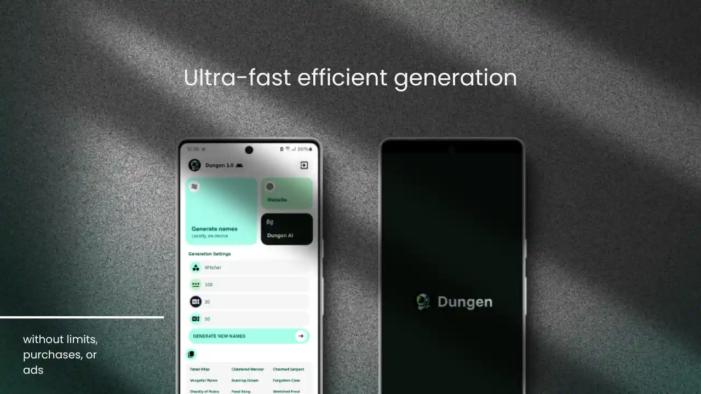
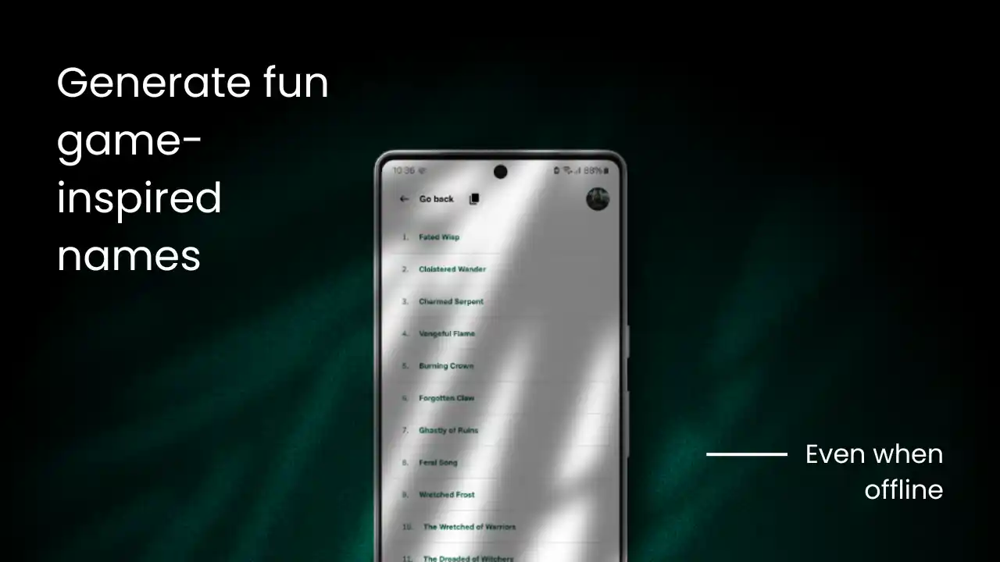
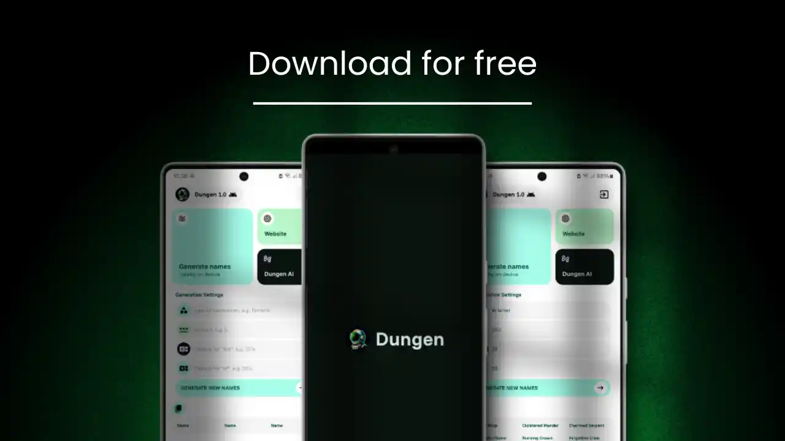

#### Minimum Requirements

**Storage:**
- **Minimum:** 50 MB of available storage space
- **Recommended:** 100 MB of available storage space

**RAM:**
- **Minimum:** 1 GB
- **Recommended:** 2 GB

#### Operating System Specifics
**Android:**
- **Minimum:** SDK Version 21 (Android 5.0)
- **Target:** SDK Version 34 (Android 14)

> [!WARNING]
> Dungen for Android does not officially support lower platform versions than those specified. We don't recommend running Dungen on these versions.

#### Platforms
| Platform | Available For Platform | Direct App | Setup
|----------------------|---|---|---|
| macOS | :x: | :x: | :x: |
| Windows | :x: | :x: | :x: |
| Linux | :x: | :x: | :x: |
| Android | :ballot_box_with_check: | :x: | :ballot_box_with_check: (APK file) |
| iOS | :x: | :x: | :x: |
